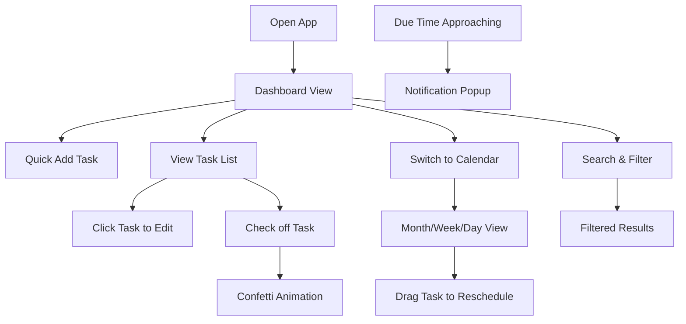

## 1. Product Overview

SparkleTask is a vibrant, girlie-themed personal task manager that turns boring to-do lists into a delightful experience. With a playful pastel aesthetic, calendar integration, and satisfying interactions, staying organized has never been this cute!
- Solves the problem of mundane task management by injecting joy and personality into daily productivity
- Targets users who want a fun, visually appealing way to organize tasks, deadlines, and schedules
- Creates an emotional connection through delightful design, making productivity feel rewarding and fun

## 2. Core Features

### 2.1 Feature Module
1. **Task Dashboard**: Task list with colorful cards, quick add, completion animations, sparkle effects
2. **Calendar View**: Monthly/weekly/daily calendar with drag-and-drop rescheduling, color-coded tasks
3. **Task Editor**: Create/edit tasks with title, description, priority, due date/time, categories
4. **Search & Filter**: Keyword search, filter by category/priority/status/date range
5. **Notifications**: In-app popup reminders, cute notification animations
6. **Categories & Priority**: Color-coded categories (Work, Personal, Study, Self-Care, etc.) and priority levels

### 2.2 Page Details
| Page Name | Module Name | Feature description |
|-----------|-------------|---------------------|
| Dashboard | Task List | Colorful gradient task cards with priority badges, category tags, completion checkboxes with confetti animation, hover effects, sparkle particles |
| Dashboard | Quick Add Bar | Floating pastel gradient input bar for quick task creation, animated "+" button |
| Dashboard | Stats Summary | Cute stat cards showing completed today, total tasks, upcoming deadlines with emoji icons |
| Dashboard | Category Filter Pills | Scrollable pastel category pills for quick filtering |
| Calendar View | Month/Week/Day Toggle | Cute toggle buttons with icons showing different calendar views |
| Calendar View | Calendar Grid | Pastel gradient cells, today highlighted with sparkle ring, tasks displayed as colored chips |
| Calendar View | Drag & Drop | Smooth drag animations, task reordering with visual feedback, ghost preview |
| Task Modal | Task Form | Gradient backgrounds, cute input fields with icons, priority selector with color swatches, date picker with pastel theme |
| Task Modal | Category Selector | Colorful category chips with custom colors, add new category option |
| Search Bar | Search & Filter | Animated search input with magnifying glass icon, filter dropdowns with pretty styling |
| Notifications | Reminder Popups | Floating notification toasts with pastel gradients, cute bell icon, slide-in animation |

## 3. Core Process

User opens the app and is greeted by a cheerful dashboard with pastel gradients and floating sparkles. They can quickly add a task using the floating input bar, or click to see full details. Tasks appear as colorful gradient cards that bounce in with animation. Users can switch to the calendar view to see their tasks laid out in monthly, weekly, or daily format, and drag tasks around to reschedule. When a task is due soon, a cute notification pops in with a gentle animation. Checking off tasks triggers confetti and sparkle effects, making productivity feel rewarding!

## 4. User Interface Design

### 4.1 Design Style
- **Primary Colors**: Bubblegum pink (#FF6B9D), lavender purple (#C084FC), sky blue (#60A5FA), mint green (#34D399)
- **Secondary Colors**: Peach (#FDBA74), hot pink (#EC4899), periwinkle (#818CF8), baby pink (#F9A8D4)
- **Background**: Soft gradient mesh with pastel pink, lavender, and peach blobs, subtle sparkle texture overlay
- **Button Style**: Rounded pill buttons with gradient backgrounds, soft glow on hover, scale-up animation
- **Fonts**: Display font "Fredoka" or "Quicksand" for headings, "Poppins" for body text - playful yet readable
- **Layout Style**: Card-based with rounded corners (20px+), soft drop shadows, floating elements, asymmetrical playful grid
- **Icons/Emoji**: Heavy use of cute emoji (✨🌸🎀💖⭐🌈), line icons with pastel colors
- **Animations**: Bounce effects, float animations, sparkle particles, confetti bursts, gradient shifts

### 4.2 Page Design Overview
| Page Name | Module Name | UI Elements |
|-----------|-------------|-------------|
| Dashboard | Header | Gradient background, cute logo with sparkle emoji, notification bell with badge, user avatar |
| Dashboard | Stats Cards | 3 pastel gradient cards (pink, purple, blue) with emoji icons, animated count-up numbers |
| Dashboard | Category Pills | Scrollable row of rounded pills, each with unique gradient, selected state with glow |
| Dashboard | Task Cards | White/light gradient cards with colored left border by priority, category tags, due date, hover lift effect |
| Dashboard | Floating Add Button | Circular gradient button with "+" icon, pulses gently, spins on hover |
| Calendar View | View Toggle | Pill-shaped toggle with 3 options, sliding indicator with gradient |
| Calendar View | Calendar Grid | Pastel day cells, weekend cells tinted pink, today with sparkle ring border |
| Calendar View | Task Chips | Rounded gradient chips on calendar days, truncated text, tooltip on hover |
| Task Modal | Modal Container | Rounded corners, gradient header, close button with heart icon, slide-up animation |
| Task Modal | Form Inputs | Rounded inputs with pastel borders, icon prefixes, focus glow effect |
| Task Modal | Priority Selector | 3 colored circles (red=High, yellow=Medium, green=Low) with labels, selected state enlarges |
| Notifications | Toast | Floating top-right toast, gradient background, bell icon, slide-in from right, auto-dismiss |

### 4.3 Responsiveness
- Desktop-first design with full calendar grid and side-by-side task list
- Tablet: Calendar grid adjusts, task list stacks below
- Mobile: Vertical layout, calendar becomes horizontal scrollable week view, task cards full width
- Touch-friendly targets (minimum 44x44px), swipe gestures for navigation
- All animations work smoothly on mobile, reduced motion support

### 4.4 Delightful Details
- **Sparkle particles**: Subtle floating sparkles in background
- **Confetti on completion**: Colorful confetti burst when checking tasks
- **Hover effects**: Cards lift slightly, buttons glow, icons wiggle
- **Loading states**: Cute bouncing loader dots in pastel colors
- **Empty states**: Cute illustrations with encouraging messages
- **Text gradients**: Headings with rainbow/pastel gradient text effects
