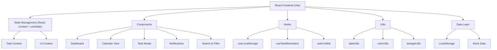
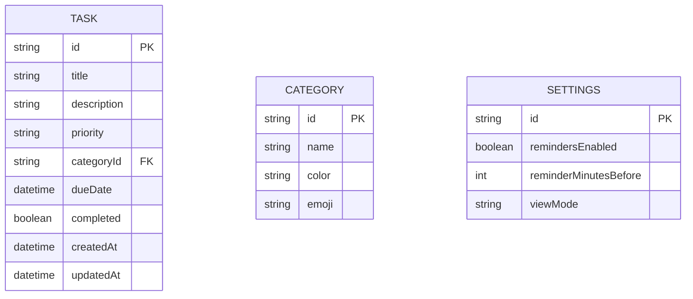

## 1. Architecture Design



## 2. Technology Description

- **Frontend**: React 18 + TypeScript + Vite 5
- **Styling**: Tailwind CSS 3 with custom theme, CSS animations
- **State Management**: React Context API + useState/useReducer
- **Calendar**: Custom-built calendar component (no external calendar library)
- **Drag & Drop**: HTML5 Drag and Drop API with custom React implementation
- **Icons**: React Icons (react-icons) with emoji accents
- **Animations**: CSS keyframes, CSS transitions, Framer Motion (optional for complex animations)
- **Data Persistence**: LocalStorage with JSON serialization
- **Notifications**: Browser Notifications API + in-app toast notifications
- **Fonts**: Google Fonts (Fredoka, Poppins)

## 3. Route Definitions

| Route | Purpose |
|-------|---------|
| / | Main dashboard with task list and quick actions |
| /calendar | Calendar view with month/week/day options |

## 4. Data Model

### 4.1 Data Model Definition



### 4.2 Data Definitions

**Task Interface:**
```typescript
interface Task {
  id: string;
  title: string;
  description: string;
  priority: 'high' | 'medium' | 'low';
  categoryId: string;
  dueDate: string;
  completed: boolean;
  createdAt: string;
  updatedAt: string;
}
```

**Category Interface:**
```typescript
interface Category {
  id: string;
  name: string;
  color: string;
  emoji: string;
}
```

**Default Categories:**
- Work: 💼 color: #60A5FA
- Personal: 🌸 color: #EC4899
- Study: 📚 color: #C084FC
- Self-Care: 💖 color: #FB7185
- Health: 🌿 color: #34D399
- Finance: 💰 color: #FBBF24
- Social: 🎀 color: #F472B6

## 5. Component Architecture

### 5.1 Core Components

```
src/
├── components/
│   ├── layout/
│   │   ├── Header.tsx          # App header with nav and notifications
│   │   ├── Sidebar.tsx         # Side navigation (desktop)
│   │   └── SparkleBg.tsx       # Animated sparkle background
│   ├── dashboard/
│   │   ├── TaskList.tsx        # Main task list
│   │   ├── TaskCard.tsx        # Individual task card
│   │   ├── QuickAdd.tsx        # Quick add task bar
│   │   ├── StatsCards.tsx      # Statistics summary cards
│   │   └── CategoryFilters.tsx # Category filter pills
│   ├── calendar/
│   │   ├── CalendarView.tsx    # Main calendar container
│   │   ├── MonthView.tsx       # Monthly calendar grid
│   │   ├── WeekView.tsx        # Weekly calendar view
│   │   ├── DayView.tsx         # Daily detailed view
│   │   ├── CalendarHeader.tsx  # Calendar navigation header
│   │   └── TaskChip.tsx        # Task chip on calendar
│   ├── modals/
│   │   ├── TaskModal.tsx       # Create/edit task modal
│   │   └── CategoryModal.tsx   # Manage categories modal
│   ├── common/
│   │   ├── Button.tsx          # Reusable button
│   │   ├── Input.tsx           # Styled input
│   │   ├── Badge.tsx           # Priority/category badges
│   │   ├── Toggle.tsx          # View toggle switch
│   │   ├── Toast.tsx           # Notification toast
│   │   └── Confetti.tsx        # Confetti animation
│   └── search/
│       └── SearchBar.tsx       # Search and filter bar
├── context/
│   ├── TaskContext.tsx         # Task state management
│   └── UIContext.tsx           # UI state (modals, toasts)
├── hooks/
│   ├── useLocalStorage.ts      # LocalStorage hook
│   ├── useTaskReminders.ts     # Reminder notification logic
│   └── useConfetti.ts          # Confetti animation hook
├── utils/
│   ├── dateUtils.ts            # Date manipulation helpers
│   ├── colorUtils.ts           # Color manipulation
│   └── storageUtils.ts         # Storage helpers
├── types/
│   └── index.ts                # TypeScript interfaces
├── data/
│   └── mockData.ts             # Initial sample tasks
├── App.tsx
├── main.tsx
└── index.css
```

## 6. Key Technical Decisions

1. **No backend**: Frontend-only with LocalStorage for simplicity and speed
2. **Custom calendar**: Build our own calendar component instead of using a library for full design control
3. **HTML5 Drag & Drop**: Native drag-and-drop for calendar rescheduling, no extra dependencies
4. **React Context**: Lightweight state management, no Redux needed for this scale
5. **Tailwind CSS**: Utility-first CSS with custom theme for the girlie aesthetic
6. **Framer Motion** (optional): For complex animations like confetti and page transitions
7. **React Icons**: Consistent icon library paired with emoji for personality
